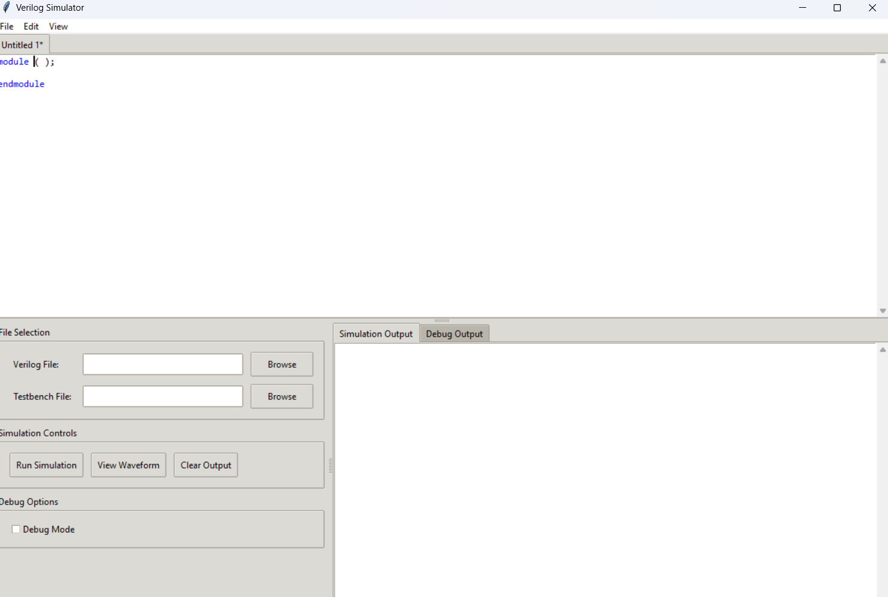
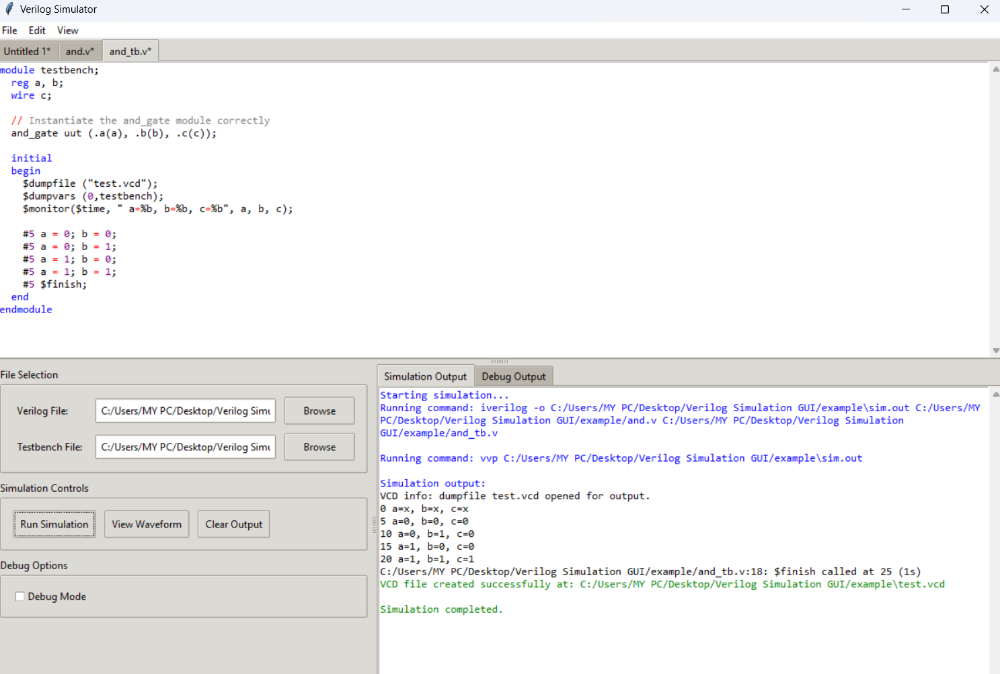
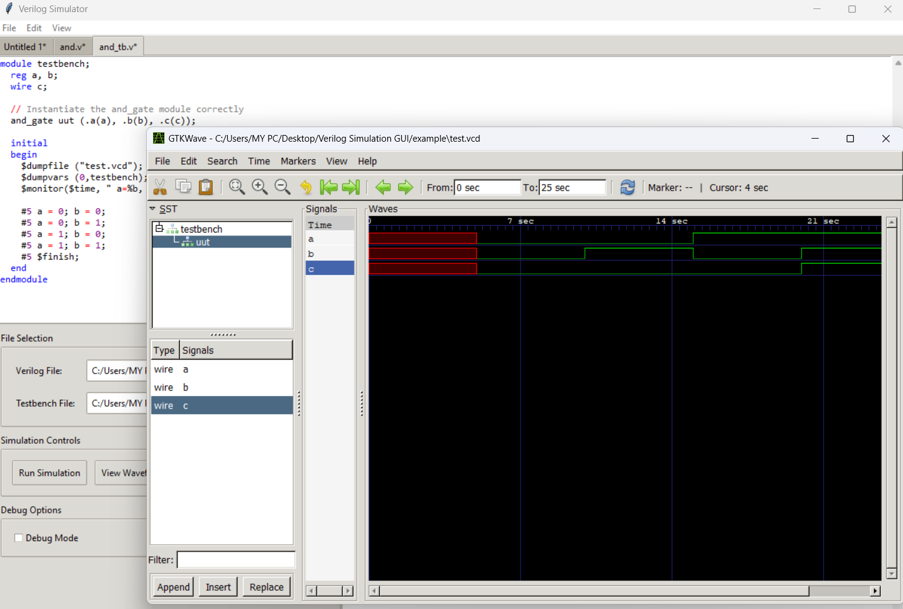
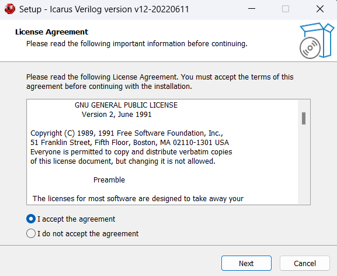

# 📟 Verilog Simulator


A Windows-based GUI application for Verilog simulation and waveform visualization built with Python. This tool provides an intuitive interface for running Verilog simulations using Icarus Verilog (iverilog) and viewing waveforms with GTKWave.

## 🚀 Quick Start

1. **Download** the latest release
2. **Install** Icarus Verilog (see [Prerequisites](#prerequisites))
3. **Add** iverilog paths to system PATH
4. **Run** the executable - no installation needed!

## ✨ Features

- 🖥️ **User-friendly GUI**: Clean and intuitive interface for Verilog simulation
- 📁 **File Management**: Easy selection of Verilog files and testbench files
- ⚡ **Simulation Controls**: Run simulations, view waveforms, and clear outputs with simple buttons
- 📊 **Integrated Output**: Real-time simulation output and debug information display
- 🌊 **Waveform Viewer**: Built-in integration with GTKWave for signal visualization
- 🐛 **Debug Support**: Optional debug mode for detailed simulation analysis

## Screenshots

### Main Interface
The application provides a clean interface with separate tabs for code editing and file management.

<div align="center">
  
</div>

### Simulation Output
Real-time display of simulation results with comprehensive logging and status information.

<div align="center">
  
</div>

### Waveform Visualization
Integrated GTKWave viewer for analyzing signal waveforms and timing diagrams.

<div align="center">
  
</div>

## 📋 Prerequisites

Before using the Verilog Simulator, you need to install Icarus Verilog on your Windows system.

### 🔧 Installing Icarus Verilog

1. **📥 Download Icarus Verilog for Windows**:
   - Visit [https://bleyer.org/icarus/](https://bleyer.org/icarus/) for Windows binaries
   - Alternatively, check the official [GitHub repository](https://github.com/steveicarus/iverilog) or [SourceForge](https://sourceforge.net/projects/iverilog/)
   - Download the latest Windows installer (includes GTKWave)

2. **🔨 Install Icarus Verilog**:

<div align="center">
  
</div>

   - Run the downloaded installer
   - Follow the installation wizard
   - Note the installation directory (typically `C:\iverilog`)

4. **🛣️ Add to System PATH**:
   
   > ⚠️ **Important**: After installation, you must add the following paths to your Windows environment variables:
   
   ```
   C:\iverilog\bin
   C:\iverilog\gtkwave\bin
   ```
   
   **To add to PATH on Windows**:
   - Right-click "This PC" → Properties → Advanced System Settings
   - Click "Environment Variables"
   - Under "System Variables", find and select "Path", then click "Edit"
   - Click "New" and add `C:\iverilog\bin`
   - Click "New" again and add `C:\iverilog\gtkwave\bin`
   - Click "OK" to save changes
   - Restart any open command prompts or applications

## 💾 Installation

> 🎉 **No installation required!** This application is portable and can be run directly.

1. 📥 Download the latest release from the [Releases](../../releases) page
2. 📂 Extract the files to your desired location
3. ▶️ Run the executable file to start the application

## 📖 Usage

1. **🚀 Launch the Application**: Double-click the executable file

2. **📁 Load Verilog Files**: 
   - Use the "Browse" button next to "Verilog File" to select your main Verilog module
   - Use the "Browse" button next to "Testbench File" to select your testbench file

3. **⚡ Run Simulation**: Click the "Run Simulation" button to execute your Verilog code

4. **📊 View Results**: 
   - Simulation output appears in the "Simulation Output" tab
   - Debug information is available in the "Debug Output" tab

5. **🌊 View Waveforms**: Click "View Waveform" to open GTKWave and analyze signal timing

6. **🧹 Clear Output**: Use "Clear Output" to reset the output displays

### 📝 Example Files

The application includes example files in the `example` folder to help you get started:

| File | Description |
|------|-------------|
| `and.v` | Simple AND gate implementation |
| `and_tb.v` | Testbench for the AND gate |
| `test.vcd` | Sample waveform output file |

**🎯 To test the application:**
1. Load `example/and.v` as the Verilog file
2. Load `example/and_tb.v` as the testbench file
3. Click "Run Simulation"
4. Click "View Waveform" to see the results

## 💻 System Requirements

| Component | Requirement |
|-----------|-------------|
| **OS** | Windows 10/11 (64-bit recommended) |
| **Dependencies** | Icarus Verilog (iverilog) and GTKWave |
| **RAM** | 4GB minimum, 8GB recommended |
| **Storage** | 100MB free space + project space |

## 🔧 Troubleshooting

### ⚠️ Common Issues

**❌ "iverilog not found" error**:
- ✅ Ensure Icarus Verilog is properly installed
- ✅ Verify that `C:\iverilog\bin` is added to your system PATH
- ✅ Restart the application after modifying PATH variables

**❌ "GTKWave not found" error**:
- ✅ Verify that `C:\iverilog\gtkwave\bin` is added to your system PATH
- ✅ Ensure GTKWave was included in your Icarus Verilog installation

**❌ Simulation fails to run**:
- ✅ Check that your Verilog syntax is correct
- ✅ Ensure both Verilog file and testbench file are selected
- ✅ Review the debug output for detailed error messages

## 📄 File Formats Supported

| Type | Extensions | Description |
|------|------------|-------------|
| **Input** | `.v`, `.verilog` | Verilog HDL source files |
| **Output** | `.vcd` | Value Change Dump for waveforms |
| **Testbench** | `.v`, `.verilog` | Standard Verilog testbench files |

## 🤝 Contributing

We welcome contributions! If you encounter bugs or have feature requests:

1. 🔍 Check existing [Issues](../../issues) to avoid duplicates
2. 🆕 Create a new issue with detailed description
3. 📋 Include system information and steps to reproduce any bugs

## 📜 License

This project is licensed under the **GNU General Public License v2.0** - see the [LICENSE](LICENSE) file for details.

## 🙏 Acknowledgments

- **Icarus Verilog**: Stephen Williams and the Icarus Verilog team for the excellent open-source Verilog compiler
- **GTKWave**: The GTKWave team for the waveform viewer
- **Python Community**: For the libraries and tools that made this GUI possible

## 📚 Version History

See [CHANGELOG.md](CHANGELOG.md) for detailed version history and updates.

---

> **📌 Note**: This application is a GUI frontend for Icarus Verilog. All simulation and compilation are handled by the underlying iverilog tools. Make sure you have the proper Icarus Verilog installation as described in the [Prerequisites](#prerequisites) section.
